# LearnCraft - Actors and Use Cases

> **⚠️ Core Requirements**: Each use case is mapped to the core requirements defined in [KEY_REQUIREMENTS.md](./KEY_REQUIREMENTS.md).

## Table of Contents
1. [Actors](#actors)
2. [Use Case Diagram](#use-case-diagram)
3. [Use Case Details](#use-case-details)
4. [Use Case Relationships](#use-case-relationships)

---

## Actors

### Primary Actors

#### 1. Learner
- **Description**: An individual using the platform to learn new skills
- **Characteristics**:
  - May be a beginner or experienced professional
  - Self-directed learning
  - Expects hands-on practice opportunities
  - Needs progress tracking and completion certificates
- **Goals**:
  - Watch video tutorials
  - Complete hands-on labs
  - Track learning progress
  - Earn certificates
  - Get help when stuck

#### 2. Instructor
- **Description**: A subject matter expert who creates and manages courses
- **Characteristics**:
  - Technical expertise in one or more domains
  - Creates video content and lab exercises
  - Monitors learner progress and engagement
  - Earns revenue from course sales
- **Goals**:
  - Create and publish courses
  - Design hands-on labs
  - Track learner engagement
  - Earn revenue
  - Get feedback on content

#### 3. Content Admin
- **Description**: Platform administrator who manages content quality and catalog
- **Characteristics**:
  - Reviews and approves content
  - Manages course catalog
  - Handles content policies
  - Curates featured content
- **Goals**:
  - Ensure content quality
  - Manage content catalog
  - Review submitted courses
  - Handle content issues

### Secondary Actors

#### 4. System Administrator
- **Description**: Technical administrator managing platform operations
- **Characteristics**:
  - Manages user accounts and permissions
  - Monitors system health
  - Handles technical issues
  - Manages platform configuration
- **Goals**:
  - Maintain platform availability
  - Manage user access
  - Monitor system performance
  - Handle support escalations

#### 5. AI Service
- **Description**: External AI/LLM service providing intelligent assistance
- **Characteristics**:
  - Generates video summaries
  - Provides contextual hints
  - Answers learner questions
  - Generates recommendations
- **Goals**:
  - Provide accurate responses
  - Offer helpful hints
  - Generate relevant recommendations

#### 6. Lab Infrastructure
- **Description**: Container orchestration system managing lab environments
- **Characteristics**:
  - Provisions lab containers
  - Manages resource allocation
  - Ensures isolation and security
  - Handles session lifecycle
- **Goals**:
  - Provision labs quickly (< 5s)
  - Maintain isolation
  - Manage resources efficiently

#### 7. Payment Gateway
- **Description**: External payment processing service
- **Characteristics**:
  - Processes subscription payments
  - Handles refunds
  - Manages payment methods
  - Provides transaction records
- **Goals**:
  - Process payments securely
  - Handle subscription billing
  - Support multiple payment methods

---

## Use Case Diagram

```mermaid
graph TB
    subgraph Actors
        L((Learner))
        I((Instructor))
        CA((Content Admin))
        SA((System Admin))
    end
    
    subgraph "Learning Use Cases"
        UC1[Browse Courses]
        UC2[Enroll in Course]
        UC3[Watch Video Lesson]
        UC4[Start Lab Session]
        UC5[Complete Lab Exercise]
        UC6[Get AI Assistance]
        UC7[Take Assessment]
        UC8[View Progress]
        UC9[Earn Certificate]
    end
    
    subgraph "Content Use Cases"
        UC10[Create Course]
        UC11[Upload Video]
        UC12[Create Lab Template]
        UC13[Publish Course]
        UC14[View Analytics]
    end
    
    subgraph "Admin Use Cases"
        UC15[Review Course]
        UC16[Manage Catalog]
        UC17[Manage Users]
        UC18[Monitor System]
        UC19[Configure Platform]
    end
    
    L --> UC1
    L --> UC2
    L --> UC3
    L --> UC4
    L --> UC5
    L --> UC6
    L --> UC7
    L --> UC8
    L --> UC9
    
    I --> UC10
    I --> UC11
    I --> UC12
    I --> UC13
    I --> UC14
    
    CA --> UC15
    CA --> UC16
    
    SA --> UC17
    SA --> UC18
    SA --> UC19
```

---

## Use Case Details

### UC1: Browse Courses

**Actor**: Learner
**Priority**: P0
**Requirement**: REQ-1 (Learning Content Delivery)

**Description**: Learner browses the course catalog to find relevant courses.

**Preconditions**:
- Platform is accessible

**Main Flow**:
1. Learner opens the course catalog
2. System displays featured and recommended courses
3. Learner filters by category, skill level, or technology
4. System displays matching courses with ratings and previews
5. Learner views course details (description, syllabus, reviews)
6. Learner decides to enroll or continue browsing

**Alternative Flows**:
- **A1**: Learner searches by keyword
- **A2**: Learner sorts by popularity, rating, or recency

**Postconditions**:
- Learner has viewed course information
- Browse activity is logged for recommendations

---

### UC2: Enroll in Course

**Actor**: Learner
**Priority**: P0
**Requirement**: REQ-1, REQ-6

**Description**: Learner enrolls in a course to gain access to content.

**Preconditions**:
- Learner is authenticated
- Course is published and available

**Main Flow**:
1. Learner clicks "Enroll" on course page
2. System checks subscription status
3. If included in subscription, enrollment is confirmed
4. System creates enrollment record
5. System adds course to learner's "My Courses"
6. Learner receives confirmation email

**Alternative Flows**:
- **A1**: Course requires purchase → redirect to payment
- **A2**: Course is full → add to waitlist
- **A3**: Learner already enrolled → show course directly

**Postconditions**:
- Enrollment record created
- Learner can access course content

---

### UC3: Watch Video Lesson

**Actor**: Learner
**Priority**: P0
**Requirement**: REQ-1 (Learning Content Delivery)

**Description**: Learner watches a video lesson within a course.

**Preconditions**:
- Learner is enrolled in the course
- Video lesson is available

**Main Flow**:
1. Learner navigates to lesson in course
2. System loads video player with lesson content
3. Learner plays video
4. System tracks watch progress continuously
5. Learner can adjust playback speed, quality, captions
6. Upon completion, system marks lesson complete
7. System shows AI-generated summary

**Alternative Flows**:
- **A1**: Learner creates bookmark at timestamp
- **A2**: Learner takes notes during video
- **A3**: Video loading fails → show error and retry option

**Postconditions**:
- Progress is saved
- Completion status updated if finished
- Summary available for review

---

### UC4: Start Lab Session

**Actor**: Learner
**Priority**: P0
**Requirement**: REQ-2 (Hands-On Lab Environment)

**Description**: Learner starts a hands-on lab session to practice skills.

**Preconditions**:
- Learner is enrolled in the course
- Lab is available for this module
- Learner has lab session quota

**Main Flow**:
1. Learner clicks "Start Lab" button
2. System checks session limits and availability
3. System provisions isolated container from pool
4. System configures environment per lab template
5. System generates secure terminal URL
6. Learner is connected to browser-based terminal/IDE
7. System displays lab instructions alongside
8. Session timer starts

**Alternative Flows**:
- **A1**: No containers available → add to queue
- **A2**: Session limit reached → show upgrade prompt
- **A3**: Provisioning fails → retry or show error

**Postconditions**:
- Lab session is active
- Resources are allocated
- Timer is running

---

### UC5: Complete Lab Exercise

**Actor**: Learner
**Priority**: P0
**Requirement**: REQ-2, REQ-7

**Description**: Learner works through lab exercises and completes them.

**Preconditions**:
- Lab session is active
- Lab instructions are available

**Main Flow**:
1. Learner follows lab instructions
2. Learner executes commands in terminal/IDE
3. System monitors learner progress
4. Learner clicks "Check Solution" when ready
5. System validates completion against success criteria
6. System displays results (pass/fail with feedback)
7. If passed, system marks lab as complete
8. System generates lab activity summary

**Alternative Flows**:
- **A1**: Learner requests hint → UC6
- **A2**: Learner resets environment
- **A3**: Session expires → prompt to extend or save progress
- **A4**: Partial completion → save progress

**Postconditions**:
- Lab completion recorded
- Progress updated
- Activity summary available

---

### UC6: Get AI Assistance

**Actor**: Learner
**Priority**: P0
**Requirement**: REQ-3 (AI-Driven Learning Assistance)

**Description**: Learner requests help from AI assistant during learning.

**Preconditions**:
- Learner is in an active learning session (video or lab)
- AI service is available

**Main Flow**:
1. Learner clicks "Get Help" or types question
2. System captures current learning context
3. System sends query with context to AI service
4. AI service generates relevant response
5. System displays response to learner
6. Learner can ask follow-up questions
7. System logs interaction for improvement

**Alternative Flows**:
- **A1**: Learner requests hint (progressive difficulty)
- **A2**: Learner reports AI response as unhelpful
- **A3**: AI service unavailable → show cached/fallback help

**Postconditions**:
- Learner received assistance
- Interaction logged for analytics

---

### UC7: Take Assessment

**Actor**: Learner
**Priority**: P1
**Requirement**: REQ-7 (Progress Tracking)

**Description**: Learner takes a quiz or assessment to validate knowledge.

**Preconditions**:
- Assessment is available
- Learner has completed prerequisites (if any)

**Main Flow**:
1. Learner starts assessment
2. System presents questions one by one
3. Learner submits answers
4. System auto-grades objective questions
5. System calculates final score
6. System displays results with explanations
7. Score is recorded in progress

**Alternative Flows**:
- **A1**: Timed assessment → enforce time limit
- **A2**: Learner exits mid-assessment → save progress
- **A3**: Learner retakes assessment

**Postconditions**:
- Assessment score recorded
- Skill competency updated

---

### UC8: View Progress

**Actor**: Learner
**Priority**: P0
**Requirement**: REQ-7 (Progress Tracking)

**Description**: Learner views their learning progress and statistics.

**Preconditions**:
- Learner is authenticated

**Main Flow**:
1. Learner opens progress dashboard
2. System displays overall progress summary
3. System shows per-course progress
4. System displays learning streak and time spent
5. System shows skill competency levels
6. System displays achievements/badges earned

**Alternative Flows**:
- **A1**: Learner views detailed course progress
- **A2**: Learner compares with peers (optional)

**Postconditions**:
- Learner is informed of progress

---

### UC9: Earn Certificate

**Actor**: Learner
**Priority**: P1
**Requirement**: REQ-7

**Description**: Learner earns a completion certificate for a course.

**Preconditions**:
- All required course components completed
- Assessment score meets threshold (if required)

**Main Flow**:
1. Learner completes final course requirement
2. System verifies all completion criteria
3. System generates unique certificate
4. System displays certificate preview
5. Learner can download or share certificate
6. Certificate is added to learner profile

**Alternative Flows**:
- **A1**: Learner shares certificate on LinkedIn
- **A2**: Third party verifies certificate via URL

**Postconditions**:
- Certificate issued and stored
- Learner can share/download

---

### UC10: Create Course

**Actor**: Instructor
**Priority**: P0
**Requirement**: REQ-8 (Content Management)

**Description**: Instructor creates a new course with modules and lessons.

**Preconditions**:
- Instructor is authenticated and approved
- Has course creation permissions

**Main Flow**:
1. Instructor opens course creation wizard
2. Instructor enters course metadata (title, description, category)
3. Instructor defines course structure (modules, lessons)
4. Instructor uploads or links video content (UC11)
5. Instructor creates lab templates (UC12)
6. Instructor adds assessments
7. Instructor previews course
8. Instructor saves as draft

**Alternative Flows**:
- **A1**: Instructor clones existing course as template
- **A2**: Instructor imports content from external source

**Postconditions**:
- Course created as draft
- Ready for video upload and lab creation

---

### UC11: Upload Video

**Actor**: Instructor
**Priority**: P0
**Requirement**: REQ-1, REQ-8

**Description**: Instructor uploads video content for lessons.

**Preconditions**:
- Course is in draft mode
- Instructor has upload permissions

**Main Flow**:
1. Instructor selects lesson to add video
2. Instructor uploads video file(s)
3. System validates video format and size
4. System initiates transcoding pipeline
5. System generates multiple quality versions
6. System extracts transcript for captions/search
7. System notifies instructor when complete
8. Video is attached to lesson

**Alternative Flows**:
- **A1**: Batch upload multiple videos
- **A2**: Video processing fails → retry or support request

**Postconditions**:
- Video processed and available
- Transcript generated
- Video attached to lesson

---

### UC12: Create Lab Template

**Actor**: Instructor
**Priority**: P0
**Requirement**: REQ-2, REQ-8

**Description**: Instructor creates a lab template for hands-on exercises.

**Preconditions**:
- Course is in draft mode
- Instructor has lab creation permissions

**Main Flow**:
1. Instructor opens lab template builder
2. Instructor selects base environment (language/stack)
3. Instructor configures environment settings
4. Instructor writes initialization script
5. Instructor adds lab instructions (markdown)
6. Instructor defines success criteria
7. Instructor tests lab template
8. Instructor saves template

**Alternative Flows**:
- **A1**: Instructor uses existing template as base
- **A2**: Lab test fails → debug and retry

**Postconditions**:
- Lab template created
- Ready for publishing

---

### UC13: Publish Course

**Actor**: Instructor
**Priority**: P0
**Requirement**: REQ-8

**Description**: Instructor submits course for review and publication.

**Preconditions**:
- Course is complete (all content uploaded)
- Course passed basic validation

**Main Flow**:
1. Instructor clicks "Submit for Review"
2. System validates course completeness
3. System notifies Content Admin for review (UC15)
4. Content Admin reviews and approves
5. System publishes course to catalog
6. System notifies instructor of publication
7. Course becomes available to learners

**Alternative Flows**:
- **A1**: Review rejected → feedback provided for revision
- **A2**: Instructor self-publishes (if approved level)

**Postconditions**:
- Course published and available
- Instructor can view analytics

---

### UC14: View Analytics

**Actor**: Instructor
**Priority**: P1
**Requirement**: REQ-7

**Description**: Instructor views analytics for their courses.

**Preconditions**:
- Course is published
- Learners have enrolled

**Main Flow**:
1. Instructor opens analytics dashboard
2. System displays course-level metrics
3. Instructor views enrollment numbers
4. Instructor views completion rates per module
5. Instructor views drop-off points
6. Instructor views learner ratings and reviews
7. Instructor views revenue (if applicable)

**Alternative Flows**:
- **A1**: Export analytics data
- **A2**: Compare across courses

**Postconditions**:
- Instructor informed of course performance

---

### UC15: Review Course

**Actor**: Content Admin
**Priority**: P1
**Requirement**: REQ-8

**Description**: Content Admin reviews submitted courses for quality.

**Preconditions**:
- Course submitted for review

**Main Flow**:
1. Content Admin opens review queue
2. System displays courses pending review
3. Admin selects course to review
4. Admin reviews content quality, accuracy, completeness
5. Admin tests lab environments
6. Admin approves or requests changes
7. System notifies instructor of decision

**Alternative Flows**:
- **A1**: Admin escalates for expert review
- **A2**: Admin flags content for policy violation

**Postconditions**:
- Course approved or feedback provided
- Status updated accordingly

---

### UC16: Manage Catalog

**Actor**: Content Admin
**Priority**: P1
**Requirement**: REQ-8

**Description**: Content Admin manages the course catalog.

**Preconditions**:
- Admin has catalog management permissions

**Main Flow**:
1. Admin opens catalog management
2. Admin views all published courses
3. Admin can feature/unfeature courses
4. Admin can organize categories/collections
5. Admin can hide/unpublish courses
6. Admin can set promotional banners

**Alternative Flows**:
- **A1**: Create curated learning paths
- **A2**: Respond to user reports about courses

**Postconditions**:
- Catalog updated as needed

---

### UC17: Manage Users

**Actor**: System Administrator
**Priority**: P0
**Requirement**: REQ-6

**Description**: System Admin manages user accounts and permissions.

**Preconditions**:
- Admin has user management permissions

**Main Flow**:
1. Admin opens user management console
2. Admin searches for user by email/name
3. Admin views user details and activity
4. Admin can modify user roles
5. Admin can disable/enable accounts
6. Admin can reset user password
7. Admin can view audit logs

**Alternative Flows**:
- **A1**: Bulk user operations (import, export)
- **A2**: Handle account recovery requests

**Postconditions**:
- User account modified as needed
- Audit log updated

---

### UC18: Monitor System

**Actor**: System Administrator
**Priority**: P0
**Requirement**: REQ-4

**Description**: System Admin monitors platform health and performance.

**Preconditions**:
- Admin has monitoring access

**Main Flow**:
1. Admin opens monitoring dashboard
2. System displays real-time metrics
3. Admin views active users, lab sessions, API traffic
4. Admin views system health (services, databases)
5. Admin views alerts and incidents
6. Admin can drill down into specific metrics

**Alternative Flows**:
- **A1**: Respond to critical alert
- **A2**: View historical trends

**Postconditions**:
- Admin informed of system status

---

### UC19: Configure Platform

**Actor**: System Administrator
**Priority**: P1
**Requirement**: REQ-4, REQ-6

**Description**: System Admin configures platform settings.

**Preconditions**:
- Admin has configuration permissions

**Main Flow**:
1. Admin opens configuration panel
2. Admin views current settings
3. Admin modifies settings (feature flags, limits, policies)
4. System validates configuration
5. Admin saves and applies changes
6. Changes take effect (immediate or after restart)

**Alternative Flows**:
- **A1**: Roll back configuration change
- **A2**: Schedule configuration change

**Postconditions**:
- Platform configuration updated

---

## Use Case Relationships

### Include Relationships
- UC2 (Enroll) **includes** Authentication
- UC3 (Watch Video) **includes** Track Progress
- UC4 (Start Lab) **includes** Provision Environment
- UC5 (Complete Lab) **includes** Validate Completion
- UC6 (Get AI Help) **includes** Capture Context
- UC13 (Publish) **includes** UC15 (Review)

### Extend Relationships
- UC3 (Watch Video) **extended by** Create Bookmark
- UC4 (Start Lab) **extended by** Extend Session
- UC5 (Complete Lab) **extended by** UC6 (Get AI Help)
- UC9 (Earn Certificate) **extended by** Share on LinkedIn

### Generalization
- Browse Courses, Search Courses → Discover Content
- Video Progress, Lab Progress → Track Progress
- Single Enrollment, Bulk Enrollment → Enrollment

---

**Last Updated**: January 2026
**Version**: 1.0
**Status**: Design Complete, Implementation Pending
