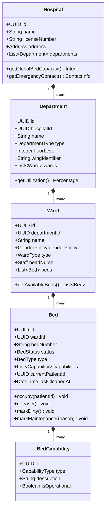
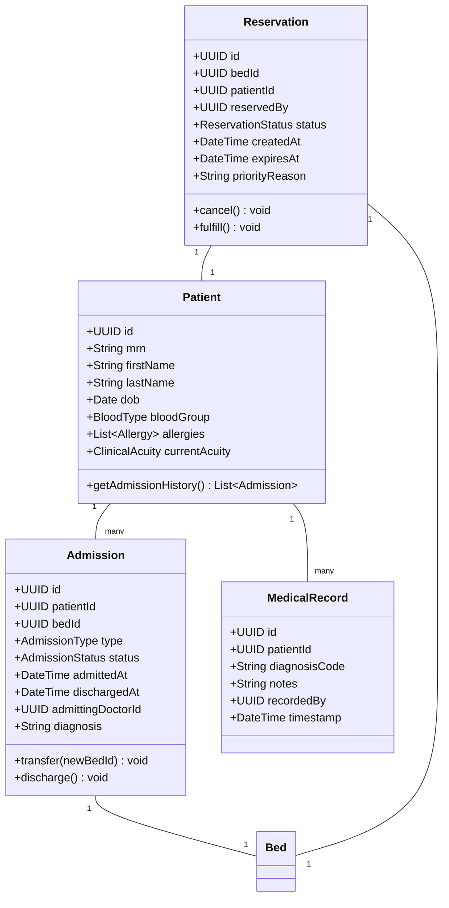
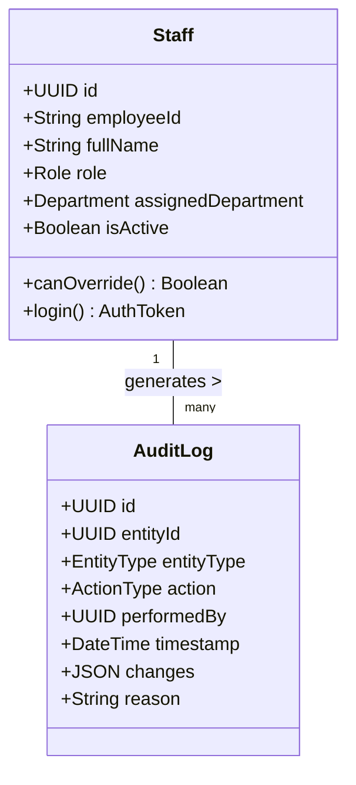
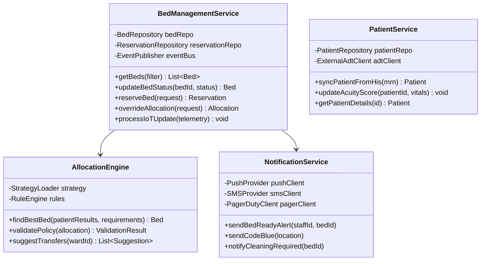
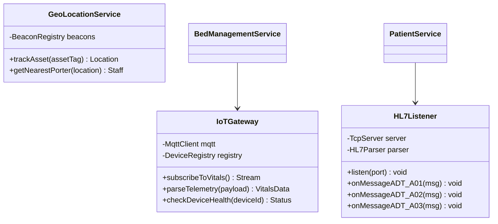
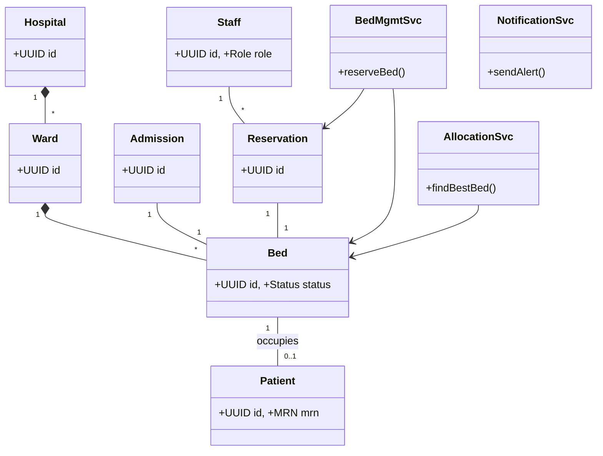

# Class Diagram - Smart Hospital ICU Management System

> **⚠️ Core Requirements**: Classes are designed around the core requirements defined in [KEY_REQUIREMENTS.md](./KEY_REQUIREMENTS.md).

## Table of Contents
1. [Overview](#overview)
2. [Domain Layer Classes](#domain-layer-classes)
3. [Service Layer Classes](#service-layer-classes)
4. [Infrastructure Layer Classes](#infrastructure-layer-classes)
5. [Complete Class Diagram](#complete-class-diagram)
6. [Class Relationships](#class-relationships)

---

## Overview

The Smart Hospital system follows a **Event-Driven Microservices Architecture**:

- **Domain Layer**: Core business entities (Hospital, Bed, Patient).
- **Service Layer**: Business logic (Allocation, Notifications).
- **Infrastructure Layer**: IoT integration and Data Persistence.

---

## Domain Layer Classes

### Operational Domain

### Patient & Admission Domain

### Staff & Access Control

---

## Service Layer Classes

### Core Services

---

## Infrastructure Layer Classes

---

## Complete Class Diagram

---

## Class Relationships

### Key Relationships

| Relationship | Description | Example |
|--------------|-------------|---------|
| **Composition** | Strong ownership | Hospital → Department → Ward |
| **Association** | Operational link | Admission → Bed |
| **Dependency** | Service Usage | BedManagementService → NotificationService |
| **Aggregation** | Grouping | Ward → Staff (Staff can work in multiple wards) |

1.  **Hospital → Department → Ward → Bed**: Hierarchical structure physically modeling the building.
2.  **Admission → Bed**: The core transactional link. An admission locks a bed for a duration.
3.  **Reservation → Bed**: A temporary lock that expires if not converted to an Admission.
4.  **Staff → AuditLog**: Security requirement to trace every override to a specific person.
