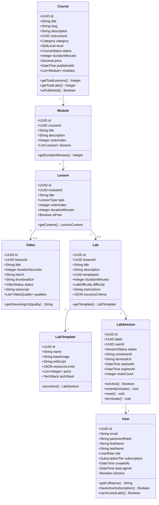
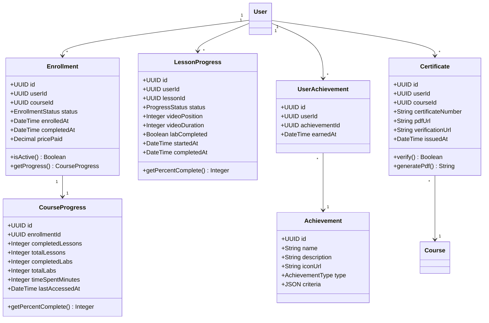
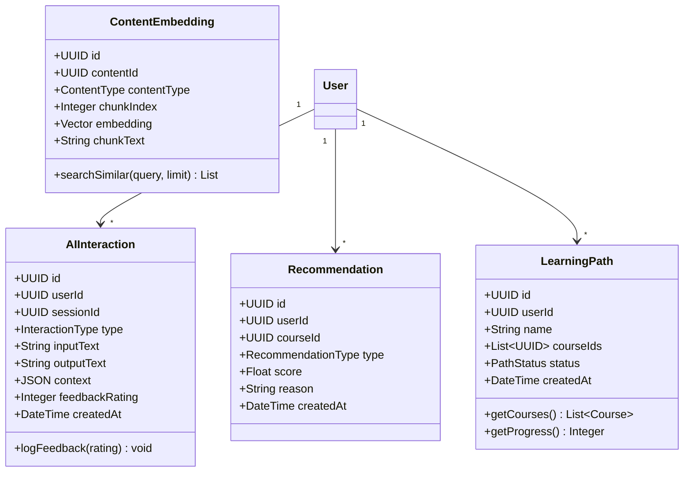
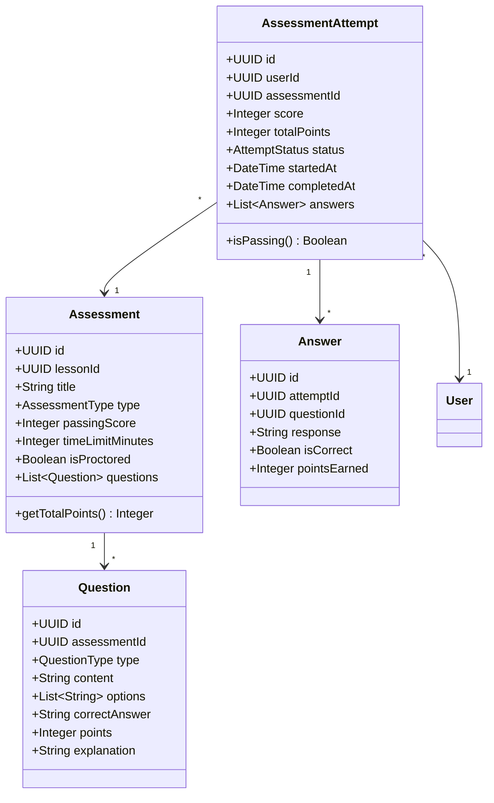
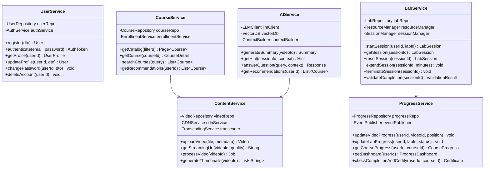
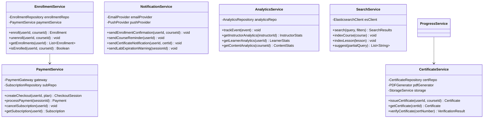
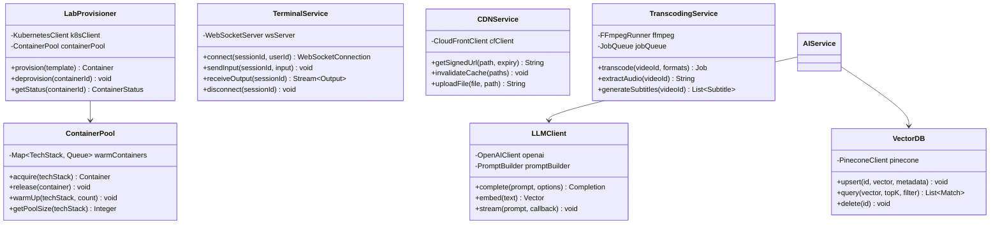
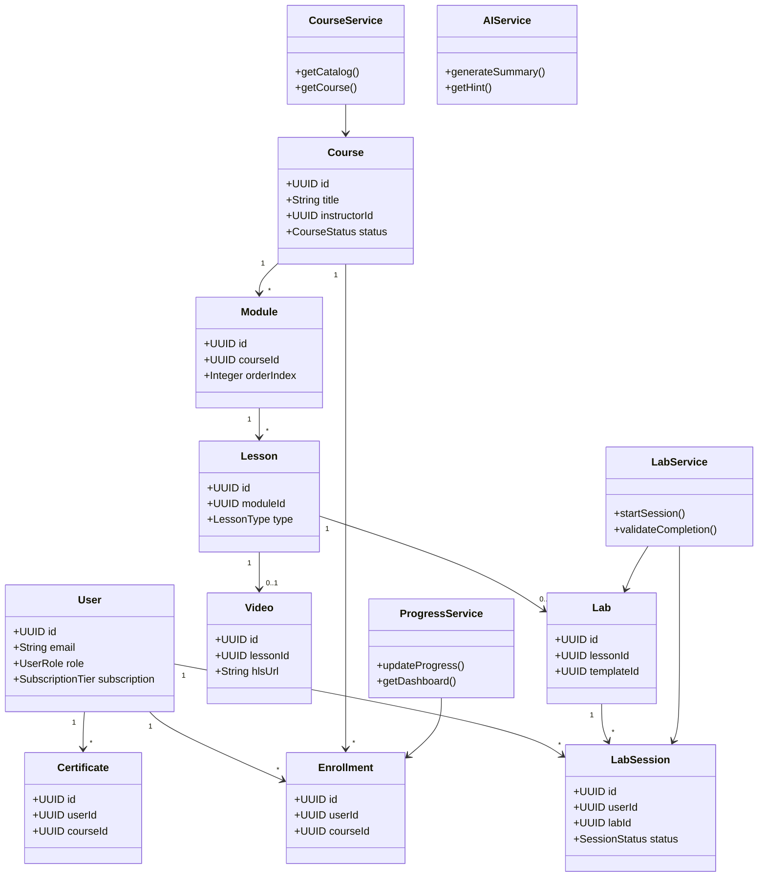

# LearnCraft - Class Diagram

> **⚠️ Core Requirements**: Classes are designed around the core requirements defined in [KEY_REQUIREMENTS.md](./KEY_REQUIREMENTS.md).

## Table of Contents
1. [Overview](#overview)
2. [Domain Layer Classes](#domain-layer-classes)
3. [Service Layer Classes](#service-layer-classes)
4. [Infrastructure Layer Classes](#infrastructure-layer-classes)
5. [Complete Class Diagram](#complete-class-diagram)
6. [Class Relationships](#class-relationships)

---

## Overview

The LearnCraft platform follows a **layered architecture** with clear separation of concerns:

- **Domain Layer**: Core business entities and value objects
- **Service Layer**: Business logic and orchestration
- **Infrastructure Layer**: External integrations and data access

---

## Domain Layer Classes

### Core Domain Classes

### Enrollment & Progress Classes

### AI & Interaction Classes

### Assessment Classes

---

## Service Layer Classes

### Core Services

### Supporting Services

---

## Infrastructure Layer Classes

---

## Complete Class Diagram

---

## Class Relationships

### Relationship Types

| Relationship | Description | Example |
|--------------|-------------|---------|
| **Inheritance** | Is-a relationship | VideoLesson → Lesson |
| **Composition** | Strong ownership, lifecycle dependent | Course → Module → Lesson |
| **Aggregation** | Weak ownership, independent lifecycle | User → Enrollment |
| **Association** | Uses / interacts with | LabService → LabSession |
| **Dependency** | Temporary usage | AIService → LLMClient |

### Key Relationships

1. **Course → Module → Lesson**: Composition - deleting a course deletes all modules and lessons
2. **User → Enrollment**: Aggregation - enrollments reference users but have independent lifecycle
3. **Lab → LabSession**: One lab template can spawn many sessions
4. **LabService → LabProvisioner**: Dependency for infrastructure operations
5. **AIService → VectorDB**: Dependency for semantic search

---

**Last Updated**: January 2026
**Version**: 1.0
**Status**: Design Complete, Implementation Pending
