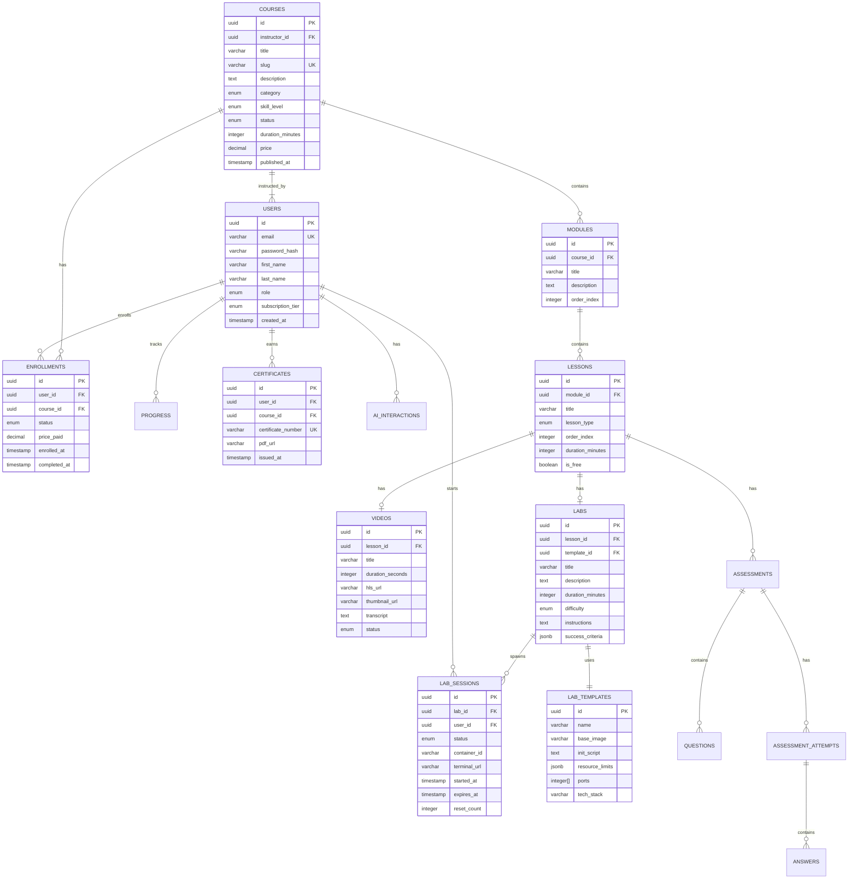

# LearnCraft - Database Schema

> **⚠️ Core Requirements**: Database design supports the core requirements defined in [KEY_REQUIREMENTS.md](./KEY_REQUIREMENTS.md).

## Table of Contents
1. [Overview](#overview)
2. [Entity Relationship Diagram](#entity-relationship-diagram)
3. [Table Definitions](#table-definitions)
4. [Indexes](#indexes)
5. [Relationships](#relationships)

---

## Overview

LearnCraft uses **PostgreSQL** as the primary database with additional specialized stores:
- **PostgreSQL**: Primary relational data (users, courses, progress)
- **Redis**: Caching, sessions, rate limiting
- **ClickHouse**: Analytics and time-series data
- **Pinecone/Weaviate**: Vector embeddings for AI

### Database Principles
1. **Normalization**: 3NF for transactional tables
2. **Soft Deletes**: Most entities use `deleted_at` instead of hard delete
3. **Audit Trails**: Created/updated timestamps on all tables
4. **UUIDs**: Primary keys use UUID for distribution
5. **Enum Constraints**: Domain values enforced via PostgreSQL enums

---

## Entity Relationship Diagram



---

## Table Definitions

### Users & Authentication

```sql
-- User Roles Enum
CREATE TYPE user_role AS ENUM ('learner', 'instructor', 'content_admin', 'system_admin');

-- Subscription Tiers Enum
CREATE TYPE subscription_tier AS ENUM ('free', 'basic', 'pro', 'premium', 'enterprise');

-- Users Table
CREATE TABLE users (
    id UUID PRIMARY KEY DEFAULT gen_random_uuid(),
    email VARCHAR(255) NOT NULL UNIQUE,
    password_hash VARCHAR(255) NOT NULL,
    first_name VARCHAR(100) NOT NULL,
    last_name VARCHAR(100) NOT NULL,
    role user_role NOT NULL DEFAULT 'learner',
    subscription_tier subscription_tier NOT NULL DEFAULT 'free',
    avatar_url VARCHAR(500),
    bio TEXT,
    is_active BOOLEAN NOT NULL DEFAULT true,
    is_email_verified BOOLEAN NOT NULL DEFAULT false,
    last_login_at TIMESTAMP,
    created_at TIMESTAMP NOT NULL DEFAULT NOW(),
    updated_at TIMESTAMP NOT NULL DEFAULT NOW(),
    deleted_at TIMESTAMP
);

-- User Preferences Table
CREATE TABLE user_preferences (
    id UUID PRIMARY KEY DEFAULT gen_random_uuid(),
    user_id UUID NOT NULL REFERENCES users(id),
    language VARCHAR(10) NOT NULL DEFAULT 'en',
    theme VARCHAR(20) NOT NULL DEFAULT 'light',
    email_notifications BOOLEAN NOT NULL DEFAULT true,
    push_notifications BOOLEAN NOT NULL DEFAULT true,
    created_at TIMESTAMP NOT NULL DEFAULT NOW(),
    updated_at TIMESTAMP NOT NULL DEFAULT NOW()
);

-- Subscriptions Table
CREATE TABLE subscriptions (
    id UUID PRIMARY KEY DEFAULT gen_random_uuid(),
    user_id UUID NOT NULL REFERENCES users(id),
    tier subscription_tier NOT NULL,
    status VARCHAR(20) NOT NULL DEFAULT 'active',
    stripe_subscription_id VARCHAR(100),
    current_period_start TIMESTAMP NOT NULL,
    current_period_end TIMESTAMP NOT NULL,
    cancel_at_period_end BOOLEAN NOT NULL DEFAULT false,
    created_at TIMESTAMP NOT NULL DEFAULT NOW(),
    updated_at TIMESTAMP NOT NULL DEFAULT NOW()
);
```

### Courses & Content

```sql
-- Course Category Enum
CREATE TYPE course_category AS ENUM (
    'web_development', 'mobile_development', 'devops', 'cloud',
    'data_science', 'machine_learning', 'security', 'databases', 'programming_languages'
);

-- Skill Level Enum
CREATE TYPE skill_level AS ENUM ('beginner', 'intermediate', 'advanced', 'expert');

-- Course Status Enum
CREATE TYPE course_status AS ENUM ('draft', 'pending_review', 'revision_needed', 'published', 'archived');

-- Courses Table
CREATE TABLE courses (
    id UUID PRIMARY KEY DEFAULT gen_random_uuid(),
    instructor_id UUID NOT NULL REFERENCES users(id),
    title VARCHAR(255) NOT NULL,
    slug VARCHAR(255) NOT NULL UNIQUE,
    short_description VARCHAR(500),
    description TEXT,
    category course_category NOT NULL,
    skill_level skill_level NOT NULL,
    status course_status NOT NULL DEFAULT 'draft',
    thumbnail_url VARCHAR(500),
    preview_video_url VARCHAR(500),
    duration_minutes INTEGER NOT NULL DEFAULT 0,
    price DECIMAL(10, 2) NOT NULL DEFAULT 0.00,
    is_featured BOOLEAN NOT NULL DEFAULT false,
    rating_average DECIMAL(3, 2) DEFAULT 0.00,
    rating_count INTEGER DEFAULT 0,
    enrollment_count INTEGER DEFAULT 0,
    published_at TIMESTAMP,
    created_at TIMESTAMP NOT NULL DEFAULT NOW(),
    updated_at TIMESTAMP NOT NULL DEFAULT NOW(),
    deleted_at TIMESTAMP
);

-- Modules Table
CREATE TABLE modules (
    id UUID PRIMARY KEY DEFAULT gen_random_uuid(),
    course_id UUID NOT NULL REFERENCES courses(id) ON DELETE CASCADE,
    title VARCHAR(255) NOT NULL,
    description TEXT,
    order_index INTEGER NOT NULL,
    created_at TIMESTAMP NOT NULL DEFAULT NOW(),
    updated_at TIMESTAMP NOT NULL DEFAULT NOW()
);

-- Lesson Type Enum
CREATE TYPE lesson_type AS ENUM ('video', 'lab', 'quiz', 'reading', 'mixed');

-- Lessons Table
CREATE TABLE lessons (
    id UUID PRIMARY KEY DEFAULT gen_random_uuid(),
    module_id UUID NOT NULL REFERENCES modules(id) ON DELETE CASCADE,
    title VARCHAR(255) NOT NULL,
    description TEXT,
    lesson_type lesson_type NOT NULL,
    order_index INTEGER NOT NULL,
    duration_minutes INTEGER NOT NULL DEFAULT 0,
    is_free BOOLEAN NOT NULL DEFAULT false,
    created_at TIMESTAMP NOT NULL DEFAULT NOW(),
    updated_at TIMESTAMP NOT NULL DEFAULT NOW()
);

-- Video Status Enum
CREATE TYPE video_status AS ENUM ('uploading', 'processing', 'ready', 'failed');

-- Videos Table
CREATE TABLE videos (
    id UUID PRIMARY KEY DEFAULT gen_random_uuid(),
    lesson_id UUID NOT NULL REFERENCES lessons(id) ON DELETE CASCADE,
    title VARCHAR(255) NOT NULL,
    original_filename VARCHAR(255),
    duration_seconds INTEGER,
    original_url VARCHAR(500),
    hls_url VARCHAR(500),
    thumbnail_url VARCHAR(500),
    status video_status NOT NULL DEFAULT 'uploading',
    transcript TEXT,
    ai_summary TEXT,
    file_size_bytes BIGINT,
    created_at TIMESTAMP NOT NULL DEFAULT NOW(),
    updated_at TIMESTAMP NOT NULL DEFAULT NOW()
);

-- Video Qualities Table
CREATE TABLE video_qualities (
    id UUID PRIMARY KEY DEFAULT gen_random_uuid(),
    video_id UUID NOT NULL REFERENCES videos(id) ON DELETE CASCADE,
    quality VARCHAR(20) NOT NULL, -- '360p', '720p', '1080p', '4k'
    bitrate INTEGER NOT NULL,
    url VARCHAR(500) NOT NULL,
    created_at TIMESTAMP NOT NULL DEFAULT NOW()
);
```

### Labs & Sessions

```sql
-- Tech Stack Enum
CREATE TYPE tech_stack AS ENUM (
    'python', 'nodejs', 'go', 'java', 'rust', 'ruby',
    'postgresql', 'mysql', 'mongodb', 'redis',
    'docker', 'kubernetes', 'terraform',
    'react', 'vue', 'angular'
);

-- Lab Difficulty Enum
CREATE TYPE lab_difficulty AS ENUM ('easy', 'medium', 'hard', 'expert');

-- Lab Templates Table
CREATE TABLE lab_templates (
    id UUID PRIMARY KEY DEFAULT gen_random_uuid(),
    name VARCHAR(255) NOT NULL,
    description TEXT,
    base_image VARCHAR(255) NOT NULL,
    tech_stack tech_stack NOT NULL,
    init_script TEXT,
    resource_limits JSONB NOT NULL DEFAULT '{"cpu": "0.5", "memory": "512Mi", "storage": "1Gi"}',
    ports INTEGER[] DEFAULT ARRAY[8080],
    environment_vars JSONB DEFAULT '{}',
    is_active BOOLEAN NOT NULL DEFAULT true,
    created_at TIMESTAMP NOT NULL DEFAULT NOW(),
    updated_at TIMESTAMP NOT NULL DEFAULT NOW()
);

-- Labs Table
CREATE TABLE labs (
    id UUID PRIMARY KEY DEFAULT gen_random_uuid(),
    lesson_id UUID NOT NULL REFERENCES lessons(id) ON DELETE CASCADE,
    template_id UUID NOT NULL REFERENCES lab_templates(id),
    title VARCHAR(255) NOT NULL,
    description TEXT,
    duration_minutes INTEGER NOT NULL DEFAULT 60,
    difficulty lab_difficulty NOT NULL DEFAULT 'medium',
    instructions TEXT NOT NULL,
    success_criteria JSONB NOT NULL,
    starter_files JSONB,
    solution_files JSONB,
    created_at TIMESTAMP NOT NULL DEFAULT NOW(),
    updated_at TIMESTAMP NOT NULL DEFAULT NOW()
);

-- Session Status Enum
CREATE TYPE session_status AS ENUM ('pending', 'provisioning', 'running', 'paused', 'completed', 'expired', 'failed');

-- Lab Sessions Table
CREATE TABLE lab_sessions (
    id UUID PRIMARY KEY DEFAULT gen_random_uuid(),
    lab_id UUID NOT NULL REFERENCES labs(id),
    user_id UUID NOT NULL REFERENCES users(id),
    status session_status NOT NULL DEFAULT 'pending',
    container_id VARCHAR(100),
    pod_name VARCHAR(100),
    terminal_url VARCHAR(500),
    started_at TIMESTAMP,
    expires_at TIMESTAMP,
    completed_at TIMESTAMP,
    reset_count INTEGER NOT NULL DEFAULT 0,
    validation_result JSONB,
    created_at TIMESTAMP NOT NULL DEFAULT NOW(),
    updated_at TIMESTAMP NOT NULL DEFAULT NOW()
);
```

### Enrollments & Progress

```sql
-- Enrollment Status Enum
CREATE TYPE enrollment_status AS ENUM ('active', 'completed', 'expired', 'cancelled');

-- Enrollments Table
CREATE TABLE enrollments (
    id UUID PRIMARY KEY DEFAULT gen_random_uuid(),
    user_id UUID NOT NULL REFERENCES users(id),
    course_id UUID NOT NULL REFERENCES courses(id),
    status enrollment_status NOT NULL DEFAULT 'active',
    price_paid DECIMAL(10, 2) NOT NULL DEFAULT 0.00,
    payment_id VARCHAR(100),
    enrolled_at TIMESTAMP NOT NULL DEFAULT NOW(),
    completed_at TIMESTAMP,
    expires_at TIMESTAMP,
    created_at TIMESTAMP NOT NULL DEFAULT NOW(),
    updated_at TIMESTAMP NOT NULL DEFAULT NOW(),
    UNIQUE(user_id, course_id)
);

-- Progress Status Enum
CREATE TYPE progress_status AS ENUM ('not_started', 'in_progress', 'completed');

-- Course Progress Table
CREATE TABLE course_progress (
    id UUID PRIMARY KEY DEFAULT gen_random_uuid(),
    enrollment_id UUID NOT NULL REFERENCES enrollments(id) ON DELETE CASCADE,
    completed_lessons INTEGER NOT NULL DEFAULT 0,
    total_lessons INTEGER NOT NULL DEFAULT 0,
    completed_labs INTEGER NOT NULL DEFAULT 0,
    total_labs INTEGER NOT NULL DEFAULT 0,
    time_spent_minutes INTEGER NOT NULL DEFAULT 0,
    percent_complete DECIMAL(5, 2) NOT NULL DEFAULT 0.00,
    last_accessed_at TIMESTAMP,
    created_at TIMESTAMP NOT NULL DEFAULT NOW(),
    updated_at TIMESTAMP NOT NULL DEFAULT NOW()
);

-- Lesson Progress Table
CREATE TABLE lesson_progress (
    id UUID PRIMARY KEY DEFAULT gen_random_uuid(),
    user_id UUID NOT NULL REFERENCES users(id),
    lesson_id UUID NOT NULL REFERENCES lessons(id),
    status progress_status NOT NULL DEFAULT 'not_started',
    video_position_seconds INTEGER DEFAULT 0,
    video_duration_seconds INTEGER DEFAULT 0,
    video_completed BOOLEAN NOT NULL DEFAULT false,
    lab_completed BOOLEAN NOT NULL DEFAULT false,
    quiz_score INTEGER,
    started_at TIMESTAMP,
    completed_at TIMESTAMP,
    created_at TIMESTAMP NOT NULL DEFAULT NOW(),
    updated_at TIMESTAMP NOT NULL DEFAULT NOW(),
    UNIQUE(user_id, lesson_id)
);

-- Video Bookmarks Table
CREATE TABLE video_bookmarks (
    id UUID PRIMARY KEY DEFAULT gen_random_uuid(),
    user_id UUID NOT NULL REFERENCES users(id),
    video_id UUID NOT NULL REFERENCES videos(id),
    position_seconds INTEGER NOT NULL,
    note TEXT,
    created_at TIMESTAMP NOT NULL DEFAULT NOW()
);
```

### Assessments

```sql
-- Assessment Type Enum
CREATE TYPE assessment_type AS ENUM ('quiz', 'practice', 'exam', 'certification');

-- Question Type Enum
CREATE TYPE question_type AS ENUM ('multiple_choice', 'multi_select', 'true_false', 'fill_blank', 'code');

-- Assessments Table
CREATE TABLE assessments (
    id UUID PRIMARY KEY DEFAULT gen_random_uuid(),
    lesson_id UUID REFERENCES lessons(id) ON DELETE CASCADE,
    title VARCHAR(255) NOT NULL,
    description TEXT,
    assessment_type assessment_type NOT NULL DEFAULT 'quiz',
    passing_score INTEGER NOT NULL DEFAULT 70,
    time_limit_minutes INTEGER,
    max_attempts INTEGER DEFAULT 3,
    shuffle_questions BOOLEAN NOT NULL DEFAULT true,
    show_answers_after BOOLEAN NOT NULL DEFAULT true,
    is_proctored BOOLEAN NOT NULL DEFAULT false,
    created_at TIMESTAMP NOT NULL DEFAULT NOW(),
    updated_at TIMESTAMP NOT NULL DEFAULT NOW()
);

-- Questions Table
CREATE TABLE questions (
    id UUID PRIMARY KEY DEFAULT gen_random_uuid(),
    assessment_id UUID NOT NULL REFERENCES assessments(id) ON DELETE CASCADE,
    question_type question_type NOT NULL,
    content TEXT NOT NULL,
    options JSONB, -- for multiple choice
    correct_answer TEXT NOT NULL,
    explanation TEXT,
    points INTEGER NOT NULL DEFAULT 1,
    order_index INTEGER NOT NULL,
    created_at TIMESTAMP NOT NULL DEFAULT NOW(),
    updated_at TIMESTAMP NOT NULL DEFAULT NOW()
);

-- Attempt Status Enum
CREATE TYPE attempt_status AS ENUM ('in_progress', 'completed', 'timed_out');

-- Assessment Attempts Table
CREATE TABLE assessment_attempts (
    id UUID PRIMARY KEY DEFAULT gen_random_uuid(),
    user_id UUID NOT NULL REFERENCES users(id),
    assessment_id UUID NOT NULL REFERENCES assessments(id),
    status attempt_status NOT NULL DEFAULT 'in_progress',
    score INTEGER,
    total_points INTEGER,
    percent_score DECIMAL(5, 2),
    is_passing BOOLEAN,
    started_at TIMESTAMP NOT NULL DEFAULT NOW(),
    completed_at TIMESTAMP,
    created_at TIMESTAMP NOT NULL DEFAULT NOW()
);

-- Answers Table
CREATE TABLE answers (
    id UUID PRIMARY KEY DEFAULT gen_random_uuid(),
    attempt_id UUID NOT NULL REFERENCES assessment_attempts(id) ON DELETE CASCADE,
    question_id UUID NOT NULL REFERENCES questions(id),
    response TEXT,
    is_correct BOOLEAN,
    points_earned INTEGER NOT NULL DEFAULT 0,
    created_at TIMESTAMP NOT NULL DEFAULT NOW()
);
```

### Certificates

```sql
-- Certificates Table
CREATE TABLE certificates (
    id UUID PRIMARY KEY DEFAULT gen_random_uuid(),
    user_id UUID NOT NULL REFERENCES users(id),
    course_id UUID NOT NULL REFERENCES courses(id),
    certificate_number VARCHAR(50) NOT NULL UNIQUE,
    title VARCHAR(255) NOT NULL,
    pdf_url VARCHAR(500),
    verification_url VARCHAR(500),
    issued_at TIMESTAMP NOT NULL DEFAULT NOW(),
    created_at TIMESTAMP NOT NULL DEFAULT NOW(),
    UNIQUE(user_id, course_id)
);
```

### AI & Analytics

```sql
-- Interaction Type Enum
CREATE TYPE interaction_type AS ENUM ('query', 'hint', 'summary', 'recommendation', 'explanation');

-- AI Interactions Table
CREATE TABLE ai_interactions (
    id UUID PRIMARY KEY DEFAULT gen_random_uuid(),
    user_id UUID NOT NULL REFERENCES users(id),
    session_id UUID REFERENCES lab_sessions(id),
    interaction_type interaction_type NOT NULL,
    input_text TEXT NOT NULL,
    output_text TEXT NOT NULL,
    context JSONB,
    model_used VARCHAR(50),
    tokens_used INTEGER,
    response_time_ms INTEGER,
    feedback_rating INTEGER CHECK (feedback_rating BETWEEN 1 AND 5),
    created_at TIMESTAMP NOT NULL DEFAULT NOW()
);

-- Content Embeddings Table (for RAG)
CREATE TABLE content_embeddings (
    id UUID PRIMARY KEY DEFAULT gen_random_uuid(),
    content_id UUID NOT NULL,
    content_type VARCHAR(50) NOT NULL, -- 'video', 'lesson', 'lab'
    chunk_index INTEGER NOT NULL,
    chunk_text TEXT NOT NULL,
    embedding VECTOR(1536), -- OpenAI embedding dimension
    created_at TIMESTAMP NOT NULL DEFAULT NOW()
);

-- Learning Analytics Events Table
CREATE TABLE learning_events (
    id UUID PRIMARY KEY DEFAULT gen_random_uuid(),
    user_id UUID NOT NULL REFERENCES users(id),
    event_type VARCHAR(50) NOT NULL,
    event_data JSONB NOT NULL,
    course_id UUID REFERENCES courses(id),
    lesson_id UUID REFERENCES lessons(id),
    created_at TIMESTAMP NOT NULL DEFAULT NOW()
);
```

---

## Indexes

```sql
-- Users Indexes
CREATE INDEX idx_users_email ON users(email);
CREATE INDEX idx_users_role ON users(role);
CREATE INDEX idx_users_subscription ON users(subscription_tier);

-- Courses Indexes
CREATE INDEX idx_courses_instructor ON courses(instructor_id);
CREATE INDEX idx_courses_category ON courses(category);
CREATE INDEX idx_courses_status ON courses(status);
CREATE INDEX idx_courses_slug ON courses(slug);
CREATE INDEX idx_courses_published ON courses(published_at) WHERE status = 'published';

-- Modules Indexes
CREATE INDEX idx_modules_course ON modules(course_id);
CREATE INDEX idx_modules_order ON modules(course_id, order_index);

-- Lessons Indexes
CREATE INDEX idx_lessons_module ON lessons(module_id);
CREATE INDEX idx_lessons_order ON lessons(module_id, order_index);

-- Videos Indexes
CREATE INDEX idx_videos_lesson ON videos(lesson_id);
CREATE INDEX idx_videos_status ON videos(status);

-- Labs Indexes
CREATE INDEX idx_labs_lesson ON labs(lesson_id);
CREATE INDEX idx_labs_template ON labs(template_id);

-- Lab Sessions Indexes
CREATE INDEX idx_lab_sessions_user ON lab_sessions(user_id);
CREATE INDEX idx_lab_sessions_lab ON lab_sessions(lab_id);
CREATE INDEX idx_lab_sessions_status ON lab_sessions(status);
CREATE INDEX idx_lab_sessions_active ON lab_sessions(user_id, status) WHERE status = 'running';

-- Enrollments Indexes
CREATE INDEX idx_enrollments_user ON enrollments(user_id);
CREATE INDEX idx_enrollments_course ON enrollments(course_id);
CREATE UNIQUE INDEX idx_enrollments_unique ON enrollments(user_id, course_id);

-- Progress Indexes
CREATE INDEX idx_lesson_progress_user ON lesson_progress(user_id);
CREATE INDEX idx_lesson_progress_lesson ON lesson_progress(lesson_id);

-- AI Interactions Indexes
CREATE INDEX idx_ai_interactions_user ON ai_interactions(user_id);
CREATE INDEX idx_ai_interactions_session ON ai_interactions(session_id);
CREATE INDEX idx_ai_interactions_type ON ai_interactions(interaction_type);

-- Content Embeddings Index (for vector similarity search)
CREATE INDEX idx_content_embeddings_vector ON content_embeddings USING ivfflat (embedding vector_cosine_ops);
```

---

## Relationships

### Foreign Key Relationships

| Parent Table | Child Table | Relationship | Cascade |
|--------------|-------------|--------------|---------|
| users | courses | One-to-Many | SET NULL |
| users | enrollments | One-to-Many | CASCADE |
| users | lab_sessions | One-to-Many | CASCADE |
| users | certificates | One-to-Many | CASCADE |
| courses | modules | One-to-Many | CASCADE |
| courses | enrollments | One-to-Many | CASCADE |
| modules | lessons | One-to-Many | CASCADE |
| lessons | videos | One-to-One | CASCADE |
| lessons | labs | One-to-One | CASCADE |
| labs | lab_sessions | One-to-Many | SET NULL |
| lab_templates | labs | One-to-Many | RESTRICT |

---

**Last Updated**: January 2026
**Version**: 1.0
**Status**: Design Complete, Implementation Pending
