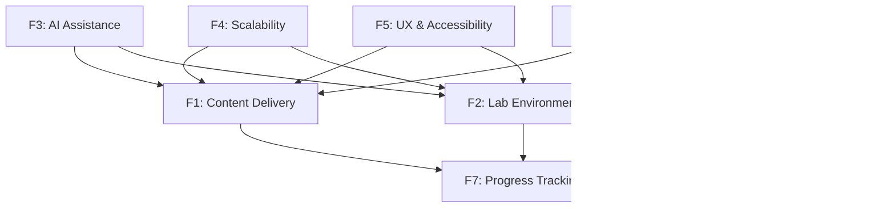

# LearnCraft - Features

> **⚠️ Core Requirements**: Each feature is mapped to the core requirements defined in [KEY_REQUIREMENTS.md](./KEY_REQUIREMENTS.md).

## Table of Contents
1. [Feature Overview](#feature-overview)
2. [Feature Details](#feature-details)
3. [Additional Features](#additional-features)
4. [Feature Dependencies](#feature-dependencies)
5. [Implementation Roadmap](#implementation-roadmap)

---

## Feature Overview

| Feature ID | Feature Name | Requirement | Priority | Status |
|------------|--------------|-------------|----------|--------|
| F1 | Learning Content Delivery | REQ-1 | P0 | ✅ Designed |
| F2 | Hands-On Lab Environment | REQ-2 | P0 | ✅ Designed |
| F3 | AI-Driven Learning Assistance | REQ-3 | P0 | ✅ Designed |
| F4 | Scalability & Reliability | REQ-4 | P0 | ✅ Designed |
| F5 | User Experience & Accessibility | REQ-5 | P1 | ✅ Designed |
| F6 | Security & Data Protection | REQ-6 | P0 | ✅ Designed |
| F7 | Progress Tracking & Analytics | REQ-7 | P1 | ✅ Designed |
| F8 | Content Management | REQ-8 | P1 | ✅ Designed |

---

## Feature Details

### F1: Learning Content Delivery

**Requirement**: REQ-1 (Learning Content Delivery)
**Priority**: P0 (Critical)
**Status**: ✅ Designed

#### Description
Host and stream high-quality video tutorials with support for structured courses, modules, and progress tracking, enhanced by AI-generated summaries to help learners quickly revise key concepts.

#### Functional Requirements

| ID | Requirement | Priority |
|----|-------------|----------|
| FR1.1 | System shall stream video content with adaptive bitrate based on network conditions | P0 |
| FR1.2 | System shall organize content into Courses → Modules → Lessons hierarchy | P0 |
| FR1.3 | System shall track video progress (position, completion percentage) per user | P0 |
| FR1.4 | System shall generate AI summaries for each video lesson | P0 |
| FR1.5 | System shall allow video bookmarks with timestamps and notes | P1 |
| FR1.6 | System shall support video playback speed adjustment (0.5x to 2x) | P1 |
| FR1.7 | System shall provide video search within course content | P1 |
| FR1.8 | System shall support subtitles/captions in multiple languages | P1 |
| FR1.9 | System shall allow offline video downloads for mobile app | P2 |
| FR1.10 | System shall support video chapters with navigation | P1 |

#### Non-Functional Requirements

| ID | Requirement | Target |
|----|-------------|--------|
| NFR1.1 | Video startup time | < 2 seconds |
| NFR1.2 | Buffering rate | < 0.1% of playback time |
| NFR1.3 | CDN availability | 99.99% uptime |
| NFR1.4 | Video quality range | 360p to 4K |

#### Technical Components
- **Services**: ContentService, VideoStreamingService, ProgressService
- **Infrastructure**: CDN (CloudFront), HLS streaming, FFmpeg transcoding
- **Storage**: S3 for videos, PostgreSQL for metadata, Redis for progress cache

#### User Stories

**US1.1**: As a learner, I want to watch video lessons so that I can learn new concepts.
- **Acceptance Criteria**:
  - Video plays within 2 seconds of clicking
  - Can adjust playback speed
  - Can toggle fullscreen
  - Progress is saved automatically

**US1.2**: As a learner, I want to see AI-generated summaries so that I can quickly review key concepts.
- **Acceptance Criteria**:
  - Summary is available after video completion
  - Summary highlights key points
  - Can save summary for later reference

**US1.3**: As a learner, I want to bookmark important moments in videos so that I can return to them later.
- **Acceptance Criteria**:
  - Can create bookmark with one click
  - Can add notes to bookmarks
  - Can navigate to bookmark from course page

---

### F2: Hands-On Lab Environment

**Requirement**: REQ-2 (Hands-On Lab Environment)
**Priority**: P0 (Critical)
**Status**: ✅ Designed

#### Description
Provide on-demand, browser-based lab environments for practical exercises, ensuring labs are isolated, secure, time-bound, and resettable after each session.

#### Functional Requirements

| ID | Requirement | Priority |
|----|-------------|----------|
| FR2.1 | System shall provision isolated lab environment within 5 seconds | P0 |
| FR2.2 | System shall provide browser-based terminal access (no local setup) | P0 |
| FR2.3 | System shall support multiple tech stacks (Python, Node.js, Go, Java, etc.) | P0 |
| FR2.4 | System shall enforce session time limits (configurable per lab) | P0 |
| FR2.5 | System shall allow one-click environment reset to initial state | P0 |
| FR2.6 | System shall provide browser-based IDE (VS Code) for coding | P0 |
| FR2.7 | System shall persist lab progress within session | P1 |
| FR2.8 | System shall validate lab completion based on success criteria | P1 |
| FR2.9 | System shall provide lab instructions alongside environment | P0 |
| FR2.10 | System shall support database labs (PostgreSQL, MySQL, MongoDB) | P1 |
| FR2.11 | System shall support cloud infrastructure labs (AWS, GCP, Azure) | P2 |
| FR2.12 | System shall allow file upload/download in lab environment | P1 |

#### Non-Functional Requirements

| ID | Requirement | Target |
|----|-------------|--------|
| NFR2.1 | Lab startup time | < 5 seconds |
| NFR2.2 | Concurrent lab sessions | 100,000+ |
| NFR2.3 | Session isolation success rate | 99.99% |
| NFR2.4 | Environment availability | 99.9% |
| NFR2.5 | Terminal response latency | < 100ms |

#### Technical Components
- **Services**: LabService, EnvironmentOrchestrator, ResourceManager
- **Infrastructure**: Kubernetes, Docker, code-server (VS Code)
- **Technology**: WebSocket for terminal, Container pooling

#### User Stories

**US2.1**: As a learner, I want to start a hands-on lab so that I can practice what I learned.
- **Acceptance Criteria**:
  - Lab starts within 5 seconds
  - Browser-based terminal is accessible
  - Lab instructions are visible alongside
  - Clear indication of time remaining

**US2.2**: As a learner, I want to reset my lab environment so that I can start fresh if I make mistakes.
- **Acceptance Criteria**:
  - Reset completes within 5 seconds
  - Environment returns to initial state
  - Confirmation prompt before reset
  - Reset count is tracked

**US2.3**: As a learner, I want my lab progress validated so that I know if I completed the exercise correctly.
- **Acceptance Criteria**:
  - Clear success/failure indication
  - Detailed feedback on what was correct/incorrect
  - Partial credit for partial completion

---

### F3: AI-Driven Learning Assistance

**Requirement**: REQ-3 (AI-Driven Learning Assistance)
**Priority**: P0 (Critical)
**Status**: ✅ Designed

#### Description
Generate summaries and key takeaways from videos and labs, provide contextual hints and troubleshooting guidance during labs, and offer personalized learning recommendations.

#### Functional Requirements

| ID | Requirement | Priority |
|----|-------------|----------|
| FR3.1 | System shall generate video summaries automatically | P0 |
| FR3.2 | System shall provide contextual hints during lab exercises | P0 |
| FR3.3 | System shall detect errors and suggest fixes in labs | P0 |
| FR3.4 | System shall answer learner questions about course content | P0 |
| FR3.5 | System shall recommend next courses based on progress | P1 |
| FR3.6 | System shall generate personalized learning paths | P1 |
| FR3.7 | System shall provide skill gap analysis | P1 |
| FR3.8 | System shall generate practice questions from content | P2 |
| FR3.9 | System shall explain code in learner's own words | P1 |
| FR3.10 | System shall provide alternative explanations when stuck | P1 |

#### Non-Functional Requirements

| ID | Requirement | Target |
|----|-------------|--------|
| NFR3.1 | AI response time | < 3 seconds |
| NFR3.2 | Hint relevancy rate | > 90% |
| NFR3.3 | AI availability | 99.9% |
| NFR3.4 | Concurrent AI sessions | 50,000+ |

#### Technical Components
- **Services**: AIService, RecommendationEngine, ContextAnalyzer
- **Technology**: OpenAI API, LangChain, Vector DB (Pinecone), RAG
- **Storage**: Content embeddings, conversation history

#### User Stories

**US3.1**: As a learner, I want to get hints when I'm stuck so that I can complete the lab without giving up.
- **Acceptance Criteria**:
  - Hint is contextually relevant
  - Hints are progressively more helpful
  - Can request more specific help

**US3.2**: As a learner, I want to ask questions about the course content so that I can clarify my understanding.
- **Acceptance Criteria**:
  - Can ask in natural language
  - Response is accurate and relevant
  - Can follow up with more questions

**US3.3**: As a learner, I want personalized course recommendations so that I can continue learning efficiently.
- **Acceptance Criteria**:
  - Recommendations based on my history
  - Shows why each course is recommended
  - Can dismiss irrelevant recommendations

---

### F4: Scalability & Reliability

**Requirement**: REQ-4 (Scalability & Reliability)
**Priority**: P0 (Critical)
**Status**: ✅ Designed

#### Description
Handle high concurrent usage for videos and labs with predictable performance, support rapid onboarding of new courses, labs, and users without performance degradation.

#### Functional Requirements

| ID | Requirement | Priority |
|----|-------------|----------|
| FR4.1 | System shall auto-scale based on demand | P0 |
| FR4.2 | System shall maintain lab container pools for fast provisioning | P0 |
| FR4.3 | System shall support multi-region deployment | P1 |
| FR4.4 | System shall provide graceful degradation during peak load | P0 |
| FR4.5 | System shall implement circuit breakers for external services | P0 |
| FR4.6 | System shall queue requests during capacity limits | P1 |
| FR4.7 | System shall support database read replicas | P1 |
| FR4.8 | System shall implement request rate limiting | P0 |

#### Non-Functional Requirements

| ID | Requirement | Target |
|----|-------------|--------|
| NFR4.1 | System uptime | 99.9% |
| NFR4.2 | Concurrent users | 500,000+ |
| NFR4.3 | Concurrent lab sessions | 100,000+ |
| NFR4.4 | API response time (p95) | < 200ms |
| NFR4.5 | Recovery time (RTO) | < 30 minutes |

#### Technical Components
- **Infrastructure**: Kubernetes HPA, Multi-region deployment
- **Patterns**: Circuit Breaker, Retry, Bulkhead, CQRS
- **Technology**: Redis for caching, CDN for static content

#### User Stories

**US4.1**: As a platform operator, I want the system to auto-scale so that performance is maintained during peak usage.
- **Acceptance Criteria**:
  - System scales up within 2 minutes of demand spike
  - No degradation during scale-up
  - Scales down during low usage to save costs

**US4.2**: As a learner, I want the platform to be always available so that I can learn without interruption.
- **Acceptance Criteria**:
  - 99.9% uptime
  - Clear communication during maintenance
  - Graceful degradation over complete failure

**US4.3**: As a platform operator, I want to add new courses rapidly so that content is always fresh.
- **Acceptance Criteria**:
  - New course deployment within minutes
  - No impact on existing users
  - Automatic content replication across regions

---

### F5: User Experience & Accessibility

**Requirement**: REQ-5 (User Experience & Accessibility)
**Priority**: P1 (High)
**Status**: ✅ Designed

#### Description
Deliver a consistent web-based experience across devices, supporting multiple languages and regions as the platform grows.

#### Functional Requirements

| ID | Requirement | Priority |
|----|-------------|----------|
| FR5.1 | System shall provide responsive design for desktop and mobile | P0 |
| FR5.2 | System shall support multiple languages (i18n) | P1 |
| FR5.3 | System shall comply with WCAG 2.1 AA accessibility standards | P1 |
| FR5.4 | System shall support dark/light themes | P2 |
| FR5.5 | System shall provide keyboard navigation | P1 |
| FR5.6 | System shall support screen readers | P1 |
| FR5.7 | System shall remember user preferences | P2 |
| FR5.8 | System shall provide progressive web app (PWA) support | P2 |

#### Non-Functional Requirements

| ID | Requirement | Target |
|----|-------------|--------|
| NFR5.1 | Page load time | < 2 seconds |
| NFR5.2 | Lighthouse performance score | > 90 |
| NFR5.3 | Lighthouse accessibility score | > 95 |
| NFR5.4 | Browser support | Chrome, Firefox, Safari, Edge |

#### Technical Components
- **Frontend**: React, Responsive CSS, i18next
- **Patterns**: Adapter Pattern (devices), Strategy Pattern (themes)
- **Technology**: Service Worker (PWA), ARIA attributes

#### User Stories

**US5.1**: As a learner, I want to use the platform on my mobile device so that I can learn on the go.
- **Acceptance Criteria**:
  - All features work on mobile
  - Touch-friendly interface
  - Video player works in mobile browsers

**US5.2**: As a learner, I want to use the platform in my preferred language so that I can understand content better.
- **Acceptance Criteria**:
  - Language can be changed in settings
  - All UI elements are translated
  - Language preference is saved

**US5.3**: As a learner with disabilities, I want the platform to be accessible so that I can learn without barriers.
- **Acceptance Criteria**:
  - Works with screen readers
  - Keyboard navigation available
  - Sufficient color contrast

---

### F6: Security & Data Protection

**Requirement**: REQ-6 (Security & Data Protection)
**Priority**: P0 (Critical)
**Status**: ✅ Designed

#### Description
Ensure secure, isolated lab environments and protect learner data through comprehensive security measures and compliance with data protection regulations.

#### Functional Requirements

| ID | Requirement | Priority |
|----|-------------|----------|
| FR6.1 | System shall isolate lab environments per learner | P0 |
| FR6.2 | System shall encrypt all data at rest | P0 |
| FR6.3 | System shall encrypt all data in transit (TLS 1.3) | P0 |
| FR6.4 | System shall implement OAuth 2.0 authentication | P0 |
| FR6.5 | System shall support multi-factor authentication | P1 |
| FR6.6 | System shall implement role-based access control (RBAC) | P0 |
| FR6.7 | System shall maintain audit logs for all actions | P0 |
| FR6.8 | System shall support enterprise SSO (SAML, OIDC) | P1 |
| FR6.9 | System shall comply with GDPR data protection | P0 |
| FR6.10 | System shall allow users to export/delete their data | P1 |

#### Non-Functional Requirements

| ID | Requirement | Target |
|----|-------------|--------|
| NFR6.1 | Security incident response time | < 1 hour |
| NFR6.2 | Lab isolation success rate | 99.99% |
| NFR6.3 | Audit log retention | 2 years |
| NFR6.4 | Penetration testing frequency | Quarterly |

#### Technical Components
- **Services**: AuthService, SecurityService, AuditService
- **Technology**: OAuth 2.0, JWT, HashiCorp Vault, TLS 1.3
- **Patterns**: Decorator Pattern, Proxy Pattern

#### User Stories

**US6.1**: As a learner, I want my lab environment isolated so that my work is private and secure.
- **Acceptance Criteria**:
  - Cannot access other learners' environments
  - Network traffic is isolated
  - Files are not shared across sessions

**US6.2**: As a learner, I want to use multi-factor authentication so that my account is secure.
- **Acceptance Criteria**:
  - Can enable MFA in settings
  - Supports authenticator apps
  - Recovery options available

**US6.3**: As a learner, I want to delete my data so that my privacy is protected.
- **Acceptance Criteria**:
  - Data deletion request processed within 30 days
  - Confirmation of deletion provided
  - Compliant with GDPR requirements

---

### F7: Progress Tracking & Analytics

**Requirement**: REQ-7 (Progress Tracking & Analytics)
**Priority**: P1 (High)
**Status**: ✅ Designed

#### Description
Comprehensive tracking of learner progress, completion rates, and learning analytics to provide insights for both learners and instructors.

#### Functional Requirements

| ID | Requirement | Priority |
|----|-------------|----------|
| FR7.1 | System shall track course completion progress | P0 |
| FR7.2 | System shall track video watch time and completion | P0 |
| FR7.3 | System shall track lab session completion and duration | P0 |
| FR7.4 | System shall display progress dashboard for learners | P0 |
| FR7.5 | System shall track learning streaks and achievements | P1 |
| FR7.6 | System shall provide instructor analytics dashboard | P1 |
| FR7.7 | System shall generate completion certificates | P1 |
| FR7.8 | System shall track skill assessments and competency | P1 |

#### Non-Functional Requirements

| ID | Requirement | Target |
|----|-------------|--------|
| NFR7.1 | Progress sync delay | < 5 seconds |
| NFR7.2 | Analytics query response time | < 2 seconds |
| NFR7.3 | Historical data retention | 5 years |

#### Technical Components
- **Services**: ProgressService, AnalyticsService, CertificateService
- **Technology**: PostgreSQL, ClickHouse (analytics), Redis
- **Patterns**: Observer Pattern, CQRS

#### User Stories

**US7.1**: As a learner, I want to see my progress so that I know how much I've completed.
- **Acceptance Criteria**:
  - Overall course progress percentage visible
  - Per-module progress breakdown
  - Time spent learning tracked

**US7.2**: As a learner, I want to earn certificates so that I can showcase my skills.
- **Acceptance Criteria**:
  - Certificate issued upon course completion
  - Certificate is verifiable
  - Can share certificate on LinkedIn

**US7.3**: As an instructor, I want to see learner analytics so that I can improve my courses.
- **Acceptance Criteria**:
  - See completion rates per module
  - See drop-off points
  - See learner feedback and ratings

---

### F8: Content Management

**Requirement**: REQ-8 (Content Management)
**Priority**: P1 (High)
**Status**: ✅ Designed

#### Description
Comprehensive tools for instructors and content admins to create, manage, and publish courses, labs, and assessments efficiently.

#### Functional Requirements

| ID | Requirement | Priority |
|----|-------------|----------|
| FR8.1 | System shall provide visual course builder | P0 |
| FR8.2 | System shall support batch video upload | P0 |
| FR8.3 | System shall auto-generate video transcripts | P1 |
| FR8.4 | System shall provide lab template management | P0 |
| FR8.5 | System shall support quiz/assessment creation | P1 |
| FR8.6 | System shall implement publish workflow (draft → review → publish) | P1 |
| FR8.7 | System shall support content versioning | P1 |
| FR8.8 | System shall allow course cloning/duplication | P2 |
| FR8.9 | System shall provide content preview mode | P1 |
| FR8.10 | System shall support bulk content import (SCORM) | P2 |

#### Non-Functional Requirements

| ID | Requirement | Target |
|----|-------------|--------|
| NFR8.1 | Video upload processing time | < 10 min/hour of content |
| NFR8.2 | Course creation time | < 30 min for basic course |
| NFR8.3 | Content publish time | < 5 minutes |

#### Technical Components
- **Services**: ContentManagementService, MediaService, WorkflowService
- **Technology**: S3, FFmpeg, Git-based versioning
- **Patterns**: Builder Pattern, State Pattern

#### User Stories

**US8.1**: As an instructor, I want to create courses easily so that I can share my knowledge.
- **Acceptance Criteria**:
  - Drag-and-drop course builder
  - Preview before publishing
  - Clear publishing workflow

**US8.2**: As an instructor, I want to upload videos in batch so that I can save time.
- **Acceptance Criteria**:
  - Multiple file upload supported
  - Progress indicator for processing
  - Notification when complete

**US8.3**: As an instructor, I want to create lab templates so that I can provide hands-on exercises.
- **Acceptance Criteria**:
  - Template creation wizard
  - Can test template before publishing
  - Can reuse templates across courses

---

## Additional Features

### AF1: Conversational AI Tutor
- Chat-based learning assistant
- Natural language Q&A
- Conversational guidance through labs

### AF2: Auto-Generated Quizzes
- AI generates quizzes from video content
- Adaptive difficulty based on performance
- Spaced repetition for retention

### AF3: Collaboration Features
- Group learning rooms
- Shared lab sessions
- Discussion forums

### AF4: Gamification
- Learning badges and achievements
- Leaderboards
- Daily/weekly learning streaks

### AF5: Enterprise LMS Integration
- SCORM/xAPI support
- LTI integration
- Custom SSO integration

### AF6: Mobile App
- Native iOS/Android apps
- Offline video download
- Push notifications

---

## Feature Dependencies

---

## Implementation Roadmap

### Phase 1: MVP (Months 1-3)
- F1: Basic video streaming and course structure
- F2: Basic lab environment (single tech stack)
- F6: Core security (authentication, isolation)
- F7: Basic progress tracking

### Phase 2: Enhanced Features (Months 4-6)
- F1: AI summaries, bookmarks
- F2: Multi-stack support, validation
- F3: AI hints and Q&A
- F8: Course builder, video upload

### Phase 3: Scale & Polish (Months 7-9)
- F4: Full scalability implementation
- F5: Multi-language, accessibility
- F7: Advanced analytics, certificates
- AF1: Conversational AI tutor

### Phase 4: Enterprise & Growth (Months 10-12)
- Enterprise features (SSO, LMS integration)
- Mobile app launch
- Gamification features
- Marketplace launch

---

**Last Updated**: January 2026
**Version**: 1.0
**Status**: Design Complete, Implementation Pending
