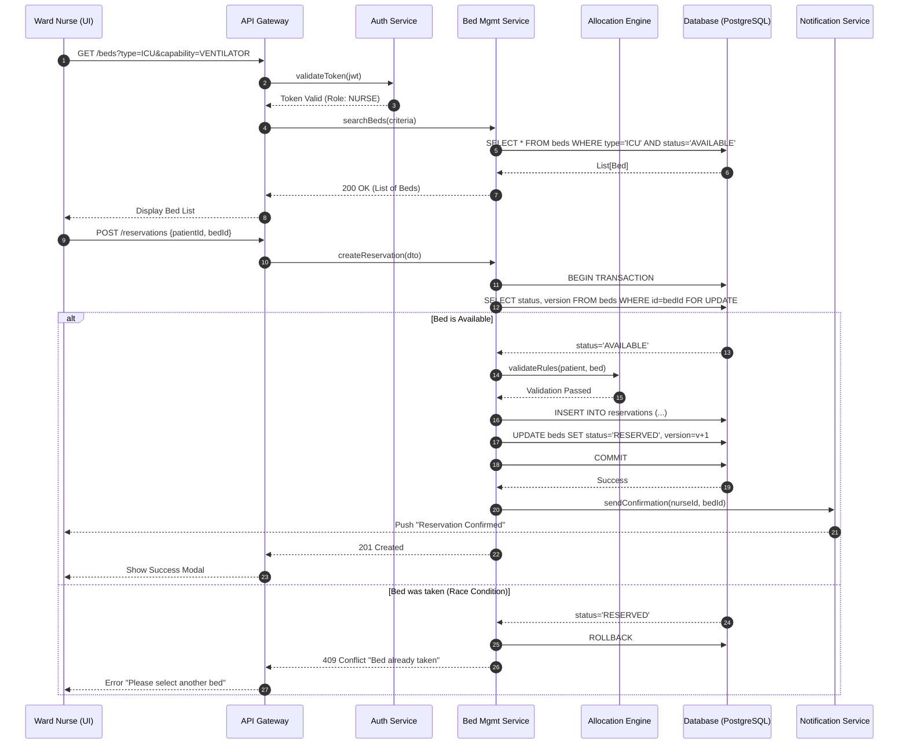
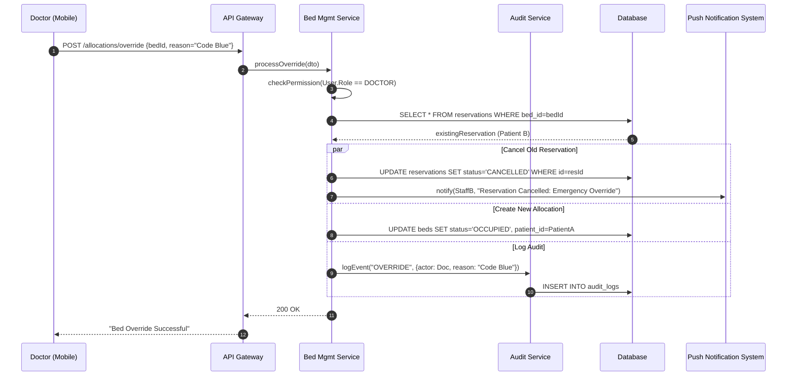
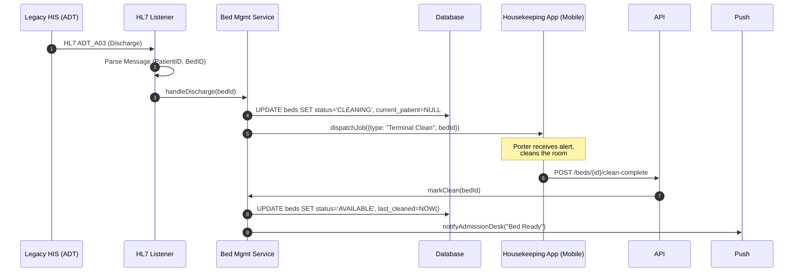
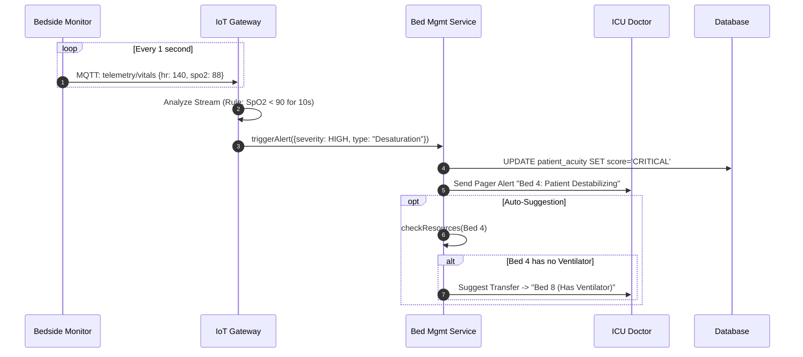

# Sequence Diagrams - Smart Hospital ICU Management System

> **⚠️ Core Requirements**: Each sequence diagram maps to the core requirements defined in [KEY_REQUIREMENTS.md](./KEY_REQUIREMENTS.md).

## Table of Contents
1. [Bed Allocation & Reservation Flow](#bed-allocation--reservation-flow)
2. [Emergency Override (Code Blue)](#emergency-override-code-blue)
3. [Patient Discharge & Bed Cleaning](#patient-discharge--bed-cleaning)
4. [IoT Vitals Alert & Auto-Transfer](#iot-vitals-alert--auto-transfer)

---

## Bed Allocation & Reservation Flow

**Requirement**: Priority-Based Auto-Allocation Implementation
**Use Case**: UC-1 (Bed Allocation)

---

## Emergency Override (Code Blue)

**Requirement**: Emergency Priority Handling
**Use Case**: UC-2 (Emergency Override)

---

## Patient Discharge & Bed Cleaning

**Requirement**: Intelligent Patient Flow
**Use Case**: UC-4 (Mark Bed Clean)

---

## IoT Vitals Alert & Auto-Transfer

**Requirement**: Smart ICU Integration
**Use Case**: UC-5 (Real-Time Acuity Update)

---

**Last Updated**: January 2026
**Version**: 1.0
