# LearnCraft - Sequence Diagrams

> **⚠️ Core Requirements**: Each sequence diagram maps to the core requirements defined in [KEY_REQUIREMENTS.md](./KEY_REQUIREMENTS.md).

## Table of Contents
1. [Course Enrollment Flow](#course-enrollment-flow)
2. [Video Streaming Flow](#video-streaming-flow)
3. [Lab Session Lifecycle](#lab-session-lifecycle)
4. [AI Assistance Request Flow](#ai-assistance-request-flow)
5. [Progress Tracking Flow](#progress-tracking-flow)
6. [Content Publishing Flow](#content-publishing-flow)

---

## Course Enrollment Flow

**Requirement**: REQ-1 (Learning Content Delivery)
**Use Case**: UC2 (Enroll in Course)

---

## Video Streaming Flow

**Requirement**: REQ-1 (Learning Content Delivery)
**Use Case**: UC3 (Watch Video Lesson)

---

## Lab Session Lifecycle

**Requirement**: REQ-2 (Hands-On Lab Environment)
**Use Case**: UC4, UC5 (Start Lab, Complete Lab)

---

## AI Assistance Request Flow

**Requirement**: REQ-3 (AI-Driven Learning Assistance)
**Use Case**: UC6 (Get AI Assistance)

```mermaid
sequenceDiagram
    autonumber
    participant L as Learner
    participant UI as Web App
    participant GW as API Gateway
    participant AI as AI Service
    participant VDB as Vector DB
    participant LLM as OpenAI API
    participant DB as Database

    L->>UI: Type question in chat
    UI->>GW: POST /api/ai/chat
    GW->>AI: processQuery(userId, query, context)
    
    AI->>AI: Extract learning context
    Note over AI: Context includes: current course,<br/>lesson, lab state, history
    
    AI->>VDB: searchSimilar(query, courseId)
    VDB-->>AI: Relevant content chunks
    
    AI->>AI: Build RAG prompt
    Note over AI: System prompt + context +<br/>relevant content + user query
    
    AI->>LLM: Generate response
    LLM-->>AI: AI response
    
    AI->>AI: Post-process response
    Note over AI: Add citations, format code,<br/>filter inappropriate content
    
    AI->>DB: Log interaction
    DB-->>AI: Logged
    
    AI-->>GW: Formatted response
    GW-->>UI: AI response
    UI-->>L: Display response
    
    opt Learner feedback
        L->>UI: Rate response (👍/👎)
        UI->>GW: POST /api/ai/feedback
        GW->>AI: logFeedback(interactionId, rating)
        AI->>DB: Store feedback
    end
```

---

## Progress Tracking Flow

**Requirement**: REQ-7 (Progress Tracking & Analytics)
**Use Case**: UC8 (View Progress)

---

## Content Publishing Flow

**Requirement**: REQ-8 (Content Management)
**Use Case**: UC13 (Publish Course)

---

## Certificate Issuance Flow

**Requirement**: REQ-7 (Progress Tracking)
**Use Case**: UC9 (Earn Certificate)

```mermaid
sequenceDiagram
    autonumber
    participant L as Learner
    participant UI as Web App
    participant GW as API Gateway
    participant PS as Progress Service
    participant CS as Certificate Service
    participant DB as Database
    participant S3 as Storage

    L->>UI: Complete final lesson/lab
    UI->>GW: POST /api/progress/complete
    GW->>PS: markComplete(userId, lessonId)
    PS->>DB: Update progress
    
    PS->>PS: Check course completion
    PS->>DB: SELECT COUNT(*) FROM completed_items
    DB-->>PS: All items completed?
    
    alt Course not fully complete
        PS-->>GW: Progress updated
        GW-->>UI: Progress saved
    else Course completed
        PS->>CS: issueCertificate(userId, courseId)
        CS->>CS: Generate certificate ID
        CS->>CS: Render certificate PDF
        CS->>S3: Upload certificate
        S3-->>CS: Certificate URL
        CS->>DB: INSERT INTO certificates
        DB-->>CS: Certificate record created
        CS-->>PS: Certificate issued
        PS-->>GW: Course completed + certificate
        GW-->>UI: Completion + certificate data
        UI-->>L: 🎉 "Congratulations! Certificate earned"
    end
    
    L->>UI: View certificate
    UI->>GW: GET /api/certificates/{id}
    GW->>CS: getCertificate(certId)
    CS->>DB: SELECT certificate
    DB-->>CS: Certificate data
    CS-->>GW: Certificate details + PDF URL
    GW-->>UI: Certificate
    UI-->>L: Display certificate preview
    
    L->>UI: Share on LinkedIn
    UI-->>L: LinkedIn share dialog
    Note over L,UI: Certificate includes<br/>verification URL
```

---

**Last Updated**: January 2026
**Version**: 1.0
**Status**: Design Complete, Implementation Pending
